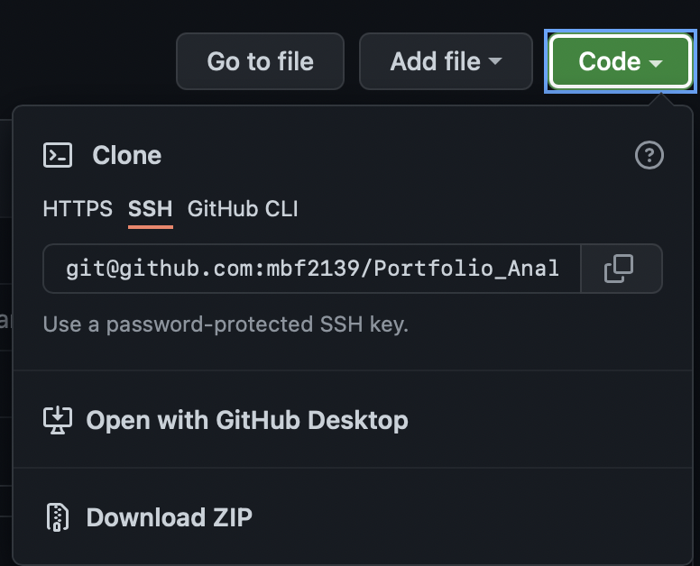
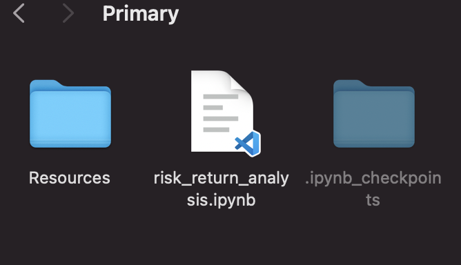
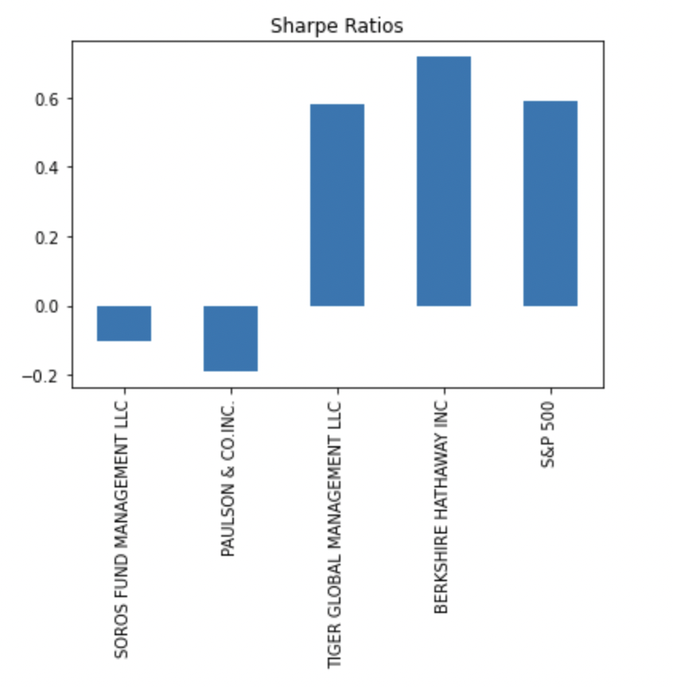

# Portfolio_Analysis

## Risk-Return Analysis of Four Major Funds vs the S&P 500

### Technologies

This app leverages python 3.7 with the followung technologies

* [pandas](https://github.com/pandas-dev/pandas) - For data analysis and manipulation.
* [numpy](https://github.com/numpy/numpy) - For scientific computing with Python
* [pathlib](https://github.com/jazzband/pathlib2) - For file manipulation.
* [matplotlib_inline](https://github.com/ipython/matplotlib-inline) - For data visualizations.

--- 

### Installation 

1. Clone the repo 

2. Before running the program make sure to install the following dependencies: 
 
       '''python
         pip install pathlib'''
---        

### Usage

1. To run the Portfolio Analysis Application navigate to the ***Primary*** folder within the repo and run the ***risk_return_analysis.ipynb*** file 

2. In the ***Resources*** folder you will find the datasets used for this analysis which contain price info on four funds and the S&P 500 index 

3. The dates and date ranges can be customized to user needs and if you follow the format the program will allow the user to determine and visulaize the risk-return profile of the funds

---

## Contributors

The starter code was contributed by the [FinTech Bootcamp at Columbia Engineering](https://bootcamp.cvn.columbia.edu/fintech/)

Matthew Field finalized the application, his work is availble to view on [Github](https://github.com/mbf2139)

---

## License

MIT